# System Architecture & Design

## 📐 System Overview

The Student Management System is built on a modern, scalable architecture using microservices principles, OAuth 2.0 authentication, and containerization.

## 🏗️ High-Level Architecture


## 🔐 Authentication Flow (OAuth 2.0)

### Authorization Code Flow


### Token Structure

**Access Token (JWT):**
```json
{
  "exp": 1705132800,
  "iat": 1705129200,
  "auth_time": 1705129200,
  "jti": "uuid",
  "iss": "http://localhost:8080/realms/student-management",
  "aud": ["student-management-client"],
  "sub": "user-uuid",
  "typ": "Bearer",
  "azp": "student-management-client",
  "session_state": "uuid",
  "acr": "1",
  "realm_access": {
    "roles": ["ADMIN"]
  },
  "scope": "openid profile email",
  "email_verified": true,
  "name": "Admin User",
  "preferred_username": "admin",
  "email": "admin@school.edu"
}
```

## 🗄️ Database Architecture

### Entity-Relationship Diagram


### Database Optimization

**Indexes:**
```sql
-- Performance indexes
CREATE INDEX idx_students_code ON students(student_code);
CREATE INDEX idx_students_email ON students(email);
CREATE INDEX idx_grades_student_class ON grades(student_id, class_id);
CREATE INDEX idx_student_classes_student ON student_classes(student_id);
CREATE INDEX idx_classes_academic_year ON classes(academic_year_id);
```

**Views for Common Queries:**
```sql
-- Pre-joined view for student details
CREATE VIEW v_students_full AS
SELECT s.*, 
       COUNT(DISTINCT sc.class_id) as enrolled_classes,
       AVG(g.score / g.max_score * 10) as overall_gpa
FROM students s
LEFT JOIN student_classes sc ON s.id = sc.student_id
LEFT JOIN grades g ON s.id = g.student_id
GROUP BY s.id;
```

## 📡 API Architecture

### Request/Response Flow


### Response Envelope Pattern

All API responses use a standard envelope:

**Success Response:**
```json
{
  "data": {
    "id": "uuid",
    "studentCode": "SV2024001",
    "name": "Nguyen Van A"
  },
  "meta": {
    "timestamp": "2026-01-13T09:47:04Z",
    "page": 1,
    "limit": 20,
    "total": 150
  },
  "message": "Success"
}
```

**Error Response:**
```json
{
  "error": {
    "code": "VALIDATION_ERROR",
    "message": "Invalid input data",
    "details": [
      {
        "field": "email",
        "message": "Invalid email format"
      }
    ]
  },
  "meta": {
    "timestamp": "2026-01-13T09:47:04Z"
  }
}
```

### API Versioning Strategy

```
/api/v1/students     ← Current version
/api/v2/students     ← Future version (breaking changes)
```

## 🔒 Security Architecture

### Multi-Layer Security


### Role-Based Access Control (RBAC)

| Resource | ADMIN | TEACHER | STUDENT |
|----------|-------|---------|---------|
| **Students** |
| List All | ✅ | ✅ | ❌ |
| View Details | ✅ | ✅ | 🔒 Own only |
| Create | ✅ | ❌ | ❌ |
| Update | ✅ | ❌ | ❌ |
| Delete | ✅ | ❌ | ❌ |
| **Classes** |
| List All | ✅ | ✅ | 🔒 Enrolled |
| Create | ✅ | ✅ | ❌ |
| Update | ✅ | 🔒 Own classes | ❌ |
| **Grades** |
| View | ✅ | 🔒 Own classes | 🔒 Own only |
| Create | ✅ | ✅ | ❌ |
| Update | ✅ | 🔒 Own grades | ❌ |

**Legend:** ✅ Full access | ❌ No access | 🔒 Limited access

### Security Best Practices Implemented

1. **Authentication**
   - ✅ OAuth 2.0 standard (not custom)
   - ✅ JWT with RSA signatures
   - ✅ Token expiration (15 min access, 30 day refresh)
   - ✅ Automatic token refresh

2. **Authorization**
   - ✅ Role-based access control
   - ✅ Resource-level permissions
   - ✅ "Me" endpoints for user context

3. **Data Protection**
   - ✅ Input validation (Bean Validation)
   - ✅ SQL injection prevention (JPA)
   - ✅ XSS prevention (React escaping)
   - ✅ CORS configuration

4. **Network Security**
   - ✅ HTTPS required (production)
   - ✅ CORS whitelisting
   - ✅ Rate limiting

5. **Audit & Monitoring**
   - ✅ Audit logs for critical operations
   - ✅ User action tracking
   - ✅ Failed login attempts logged

## 🚀 Deployment Architecture

### Docker Compose (Development)

```yaml
version: "3.8"

services:
  postgres:
    image: postgres:16-alpine
    ports: ["5432:5432"]
    volumes:
      - postgres_data:/var/lib/postgresql/data

  keycloak:
    image: quay.io/keycloak/keycloak:23.0
    ports: ["8080:8080"]
    depends_on: [postgres]

  backend:
    build: ./backend
    ports: ["8081:8081"]
    depends_on: [postgres, keycloak]
    environment:
      - SPRING_DATASOURCE_URL=jdbc:postgresql://postgres:5432/student_mgmt
      - KEYCLOAK_ISSUER_URI=http://keycloak:8080/realms/student-management

  frontend:
    build: ./frontend
    ports: ["3000:3000"]
    depends_on: [backend]
    environment:
      - NEXT_PUBLIC_API_URL=http://backend:8081/api/v1
      - KEYCLOAK_ISSUER=http://keycloak:8080/realms/student-management
```

### Production Deployment (Kubernetes)


## ⚡ Performance Optimization

### Caching Strategy

**Redis Caching:**
```java
@Cacheable(value = "dashboard-stats", key = "#academicYear")
public DashboardStats getStats(Integer academicYear) {
    // Expensive calculation
}
```

**Cache Layers:**
1. **Application Cache** - Redis (dashboard, stats)
2. **Database Cache** - PostgreSQL shared buffers
3. **CDN Cache** - Static assets (frontend)
4. **Browser Cache** - API responses with ETags

### Database Optimization

**Query Optimization:**
```java
// Bad: N+1 query problem
List<Student> students = studentRepository.findAll();
students.forEach(s -> s.getClasses().size()); // N queries!

// Good: JOIN FETCH
@Query("SELECT s FROM Student s LEFT JOIN FETCH s.classes")
List<Student> findAllWithClasses();
```

**Pagination:**
```java
Pageable pageable = PageRequest.of(page, limit, Sort.by("lastName"));
Page<Student> students = studentRepository.findAll(pageable);
```

### API Response Time Targets

| Endpoint Type | Target | Max Acceptable |
|---------------|--------|----------------|
| Simple GET (by ID) | < 50ms | 200ms |
| List with pagination | < 200ms | 500ms |
| Bulk operation | < 2s | 5s |
| Report generation | < 3s | 10s |
| Dashboard stats | < 100ms | 300ms (cached) |

## 📊 Monitoring & Observability

### Health Checks

**Backend (Spring Actuator):**
```
GET /actuator/health
GET /actuator/metrics
GET /actuator/info
```

**Response:**
```json
{
  "status": "UP",
  "components": {
    "db": { "status": "UP" },
    "keycloak": { "status": "UP" },
    "diskSpace": { "status": "UP" }
  }
}
```

### Logging Strategy

**Log Levels:**
- **ERROR:** Critical failures requiring immediate attention
- **WARN:** Degraded performance, recoverable errors
- **INFO:** Normal business operations (login, grade entry)
- **DEBUG:** Detailed diagnostic information (development only)

**Structured Logging:**
```json
{
  "timestamp": "2026-01-13T09:47:04Z",
  "level": "INFO",
  "logger": "StudentService",
  "message": "Student created successfully",
  "userId": "admin-uuid",
  "studentId": "student-uuid",
  "ip": "192.168.1.100"
}
```

## 🔄 Data Flow Examples

### Example: Creating a Grade

```mermaid
sequenceDiagram
    participant T as Teacher (Browser)
    participant F as Frontend
    participant B as Backend
    participant DB as Database

    T->>F: Fill grade form
    T->>F: Click "Save Grade"
    F->>F: Validate input (client-side)
    F->>B: POST /api/v1/grades (studentId, classId, score)
    B->>B: Validate JWT token
    B->>B: Check TEACHER role
    B->>B: Verify teacher owns class
    B->>B: Validate input (server-side)
    B->>DB: Check student enrollment
    DB->>B: Student enrolled ✓
    B->>DB: Check duplicate grade
    DB->>B: No duplicate ✓
    B->>DB: INSERT INTO grades
    DB->>B: Grade created (ID)
    B->>DB: INSERT INTO audit_logs
    B->>F: 200 OK {gradeId, score}
    F->>T: Show success message
    F->>F: Update grade list
```



### Example: Bulk Grade Import


## 📈 Scalability Considerations

### Horizontal Scaling

**Stateless Design:**
- ✅ No server-side sessions (JWT only)
- ✅ Database connection pooling
- ✅ Shared cache (Redis)

**Load Balancing:**
```
Traffic → Load Balancer
  ├─→ Backend Pod 1
  ├─→ Backend Pod 2
  └─→ Backend Pod 3
```

### Database Scaling

**Strategies:**
1. **Read Replicas** - Separate read/write databases
2. **Connection Pooling** - HikariCP (default in Spring Boot)
3. **Partitioning** - By academic year (future)
4. **Archiving** - Move old data to archive tables

## 🛠️ Technology Justification

### Why Keycloak?
- ✅ Open-source, production-ready
- ✅ LDAP/AD integration support
- ✅ Social login support
- ✅ Multi-factor authentication
- ✅ Extensive documentation

### Why Spring Boot?
- ✅ Industry standard for Java backends
- ✅ Excellent OAuth2 support
- ✅ Large ecosystem
- ✅ Production-ready features (Actuator)

### Why Next.js?
- ✅ Server-side rendering (SEO)
- ✅ File-based routing
- ✅ API routes (BFF pattern)
- ✅ Excellent TypeScript support
- ✅ Image optimization

### Why PostgreSQL?
- ✅ ACID compliance
- ✅ Advanced features (JSONB, views, triggers)
- ✅ Excellent performance
- ✅ Strong community support

---

**This architecture prioritizes security, scalability, and maintainability while following industry best practices.**
